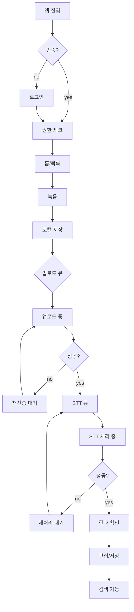

# ibk_stt 모바일 녹음·업로드 앱 기술 스펙

> 산출 기준일: 2026-05-08
> 스코프: **모바일 앱 (UI/UX + 서버 contract)**. STT 엔진과 백엔드 인프라 구현은 외부 책임.

## 목적

사내 직원이 폰에서 음성을 녹음하고, 서버로 전송한 뒤, 외부 STT 모델이 처리한 결과를 모바일에서 조회·편집·검색할 수 있게 한다. 한 줄: "손실 없는 캡처 → 재시도 가능한 업로드 → 수정 가능한 전사 자산".

## 사용자 / 사용 시점

- 사용자: IBK 사내 직원 (B2B internal)
- 사용 시점: 회의·인터뷰·현장 메모 캡처, 외부에서 짧은 녹취, 후속 정리 시
- 사용 빈도(가설): 1인당 일평균 1~3건

## 범위

| 구분 | 항목 |
| --- | --- |
| IN (이번 스펙) | 모바일 앱 UI/UX, 로컬 데이터 모델, 모바일 ↔ 서버 API contract, 상태기계, 검증 기준 |
| OUT | STT 엔진 자체 (외부 모델), provider adapter 서버측 구현, 서버 인프라/배포, 백엔드 워커 내부 |
| 가정 | STT는 서버측에서 갈아끼울 수 있는 어댑터 뒤에 있음. 앱은 provider 무관 결과 스키마만 의존 |

## 기능 요구사항 (FR)

| ID | 기능 | 설명 |
| --- | --- | --- |
| FR-1 | 인증 | 사내 SSO 또는 이메일/비밀번호 로그인, JWT access+refresh, refresh rotation |
| FR-2 | 녹음 | 시작/일시정지/재개/중지, 백그라운드 녹음, 통화·앱종료 인터럽트 복구 |
| FR-3 | 로컬 저장 | 자동저장 (≤10s 주기), 임시 파일, 앱 강제종료 후 복구 가능 |
| FR-4 | 업로드 | pre-signed multipart, 백그라운드 업로드, 자동 재시도, SHA-256 검증 |
| FR-5 | 3-track 상태 표시 | `recording_state` / `upload_state` / `transcription_state` 분리 배지 |
| FR-6 | 결과 조회 | 원문/편집본 탭, segment 리스트 (start/end/speaker/text) |
| FR-7 | 결과 편집 | 편집본 저장, 원본 보존, 버전 증가 |
| FR-8 | 검색 | title / tag / 전사문 풀텍스트 |
| FR-9 | 메타데이터 편집 | title, note, tags, language_hint |
| FR-10 | 재전송/재처리 분리 | 업로드 실패 → 재전송. STT 실패 → 재처리. **버튼 분리 필수** |
| FR-11 | 목록/필터/정렬 | 탭: All / Uploading / Done / Failed. 정렬: 최근/길이 |
| FR-12 | 푸시 알림 | STT 완료, STT 실패, 업로드 실패 (옵션) |
| FR-13 | 삭제 | soft delete → 30일 후 hard delete (서버측 정책) |

## 비기능 요구사항 (NFR)

| 영역 | 기준 |
| --- | --- |
| 성능 | 녹음 시작 latency < 300ms, 화면 전환 < 200ms |
| 신뢰성 | 업로드 실패 자동 재시도 `1s→3s→10s→30s→120s`, 최대 5회. 그 이후 사용자 수동 재전송 |
| 오프라인 | 녹음·로컬 저장은 네트워크 무관 항상 가능. 온라인 복귀 시 큐 자동 처리 |
| 보안 | 토큰은 iOS Keychain / Android Keystore. signed playback URL 만료 5~15분 |
| 접근성 | VoiceOver / TalkBack 통과, dynamic type 지원, 색맹 안전 상태색 (배지 텍스트 라벨 병기) |
| 배터리 | 화면 꺼진 상태에서도 녹음 지속 (AVAudioSession `.playAndRecord` background, Android Foreground Service) |
| 다국어 | 1차 ko-KR. 추후 en-US 확장 가능한 i18n 구조 |

## 데이터 모델 (모바일 로컬)

| 엔터티 | 핵심 필드 |
| --- | --- |
| `LocalRecording` | `id`, `title`, `draft_state`, `file_path`, `duration_ms`, `checksum_sha256`, `server_recording_id?`, `created_at` |
| `LocalUploadQueue` | `id`, `recording_id`, `attempts`, `last_error`, `next_retry_at`, `bytes_uploaded`, `bytes_total` |
| `ServerRecordingCache` | `id`, `title`, `upload_state`, `transcription_state`, `language_detected`, `created_at`, `transcript_preview` |
| `TranscriptCache` | `recording_id`, `version_no`, `edited_text`, `segments[]` |

### 상태값 (3-track, 합치지 말 것)

```
recording_state:     draft | recording | paused | saved_local | archived | deleted
upload_state:        not_started | queued | uploading | uploaded | failed | retrying
transcription_state: not_requested | queued | processing | completed | failed | cancelled
```

## API / 인터페이스 (모바일 ↔ 서버)

서버 구현은 외부 책임. 앱은 아래 contract에만 의존한다.

| Method | Path | 설명 |
| --- | --- | --- |
| POST | `/v1/auth/login` | 로그인 → access+refresh |
| POST | `/v1/auth/refresh` | access 재발급 |
| GET | `/v1/me` | 내 정보 |
| POST | `/v1/recordings` | draft 생성 (메타) |
| POST | `/v1/recordings/{id}/upload-sessions` | multipart presigned URL 발급 |
| POST | `/v1/upload-sessions/{id}/complete` | 업로드 완료 신고 (size/checksum 검증) |
| POST | `/v1/recordings/{id}/transcriptions` | STT 요청 (provider 무관) |
| POST | `/v1/transcriptions/{id}/retry` | STT 재처리 |
| GET | `/v1/recordings` | 목록 (cursor, status, tag, sort) |
| GET | `/v1/recordings/{id}` | 상세 (메타+오디오 URL+transcript) |
| PATCH | `/v1/recordings/{id}` | 메타 수정 |
| POST | `/v1/recordings/{id}/transcript-versions` | 편집본 저장 |
| GET | `/v1/search?q=` | title/tag/전사문 통합 검색 |
| DELETE | `/v1/recordings/{id}` | soft delete |

### Provider-agnostic transcript schema

앱은 어떤 STT 모델이 뒤에 있든 동일 스키마만 본다.

```json
{
  "version_no": 2,
  "edited_text": "...",
  "segments": [
    { "start_ms": 0, "end_ms": 5400, "speaker_label": "S1", "text": "...", "confidence_avg": 0.92 }
  ]
}
```

요청 시 `provider` 필드는 **선택**. 앱 기본 호출에는 포함하지 않는다 (서버가 라우팅).

## UI/UX 화면 설계

### 화면 인벤토리 (7화면)

| # | 화면 | 핵심 UI | 주요 액션 | 필수 상태 |
| --- | --- | --- | --- | --- |
| 1 | 로그인/회원가입 | 이메일·비밀번호 또는 SSO 버튼, 약관 분리 체크 | 로그인, 비밀번호 재설정 | 동의 미체크, 로그인 실패 |
| 2 | 권한 온보딩 | 마이크/알림 권한 설명 + CTA | 허용, 설정 이동 | 마이크 거부 |
| 3 | 홈/목록 | 검색바, 필터칩, 정렬, FAB(녹음) | 검색, 재생, 상세 진입, 삭제 | empty, upload-failed 목록 |
| 4 | 녹음 | 타이머, waveform, 일시정지/중지 | start, pause/resume, stop/save | 저장공간 부족, 마이크 충돌 |
| 5 | 상세/재생 | 플레이어, **3-track 배지**, 메타, 재전송/재처리 | 재생, 메타 수정, 삭제 | 업로드 실패, STT 실패 |
| 6 | 전사 결과/편집 | 원문/편집본 탭, segment 리스트, save | 편집, 버전 저장 | 결과 없음, 부분 결과 |
| 7 | 검색 결과 | query, 하이라이트, 필터 | 상세 이동 | 결과 없음 |

### UX 원칙 (가드레일과 짝)

1. **상태 분리 시각화** — `upload`와 `transcription`을 한 배지로 합치지 않는다. "업로드 완료 / STT 처리 중"을 동시에 보여줘야 한다.
2. **재전송 ≠ 재처리** — 다른 버튼, 다른 색, 다른 라벨.
3. **빈 상태/오류 상태 모두 디자인** — 6개 화면 × 4 상태(idle/loading/error/empty) = 24 변형. 누락 금지.
4. **백그라운드 진행률은 시스템 알림** — 앱 종료 후에도 업로드 진척이 보여야 한다.
5. **녹음 시작 전 권한 체크 강제** — 권한 미확인 상태로 녹음 화면 진입 금지.
6. **약관 동의는 분리 체크박스, pre-check 금지** (개인정보보호법).
7. **상태배지 텍스트 라벨 병기** — 색만으로 상태 구분 금지 (색맹 접근성).

### 사용자 흐름



## 의존성 / 영향 파일

| 구분 | 항목 |
| --- | --- |
| 신규 | 전체 (빈 프로젝트 부트스트랩) |
| 모바일 스택 (권장) | React Native (Expo bare 또는 vanilla) + TypeScript |
| 상태관리 | Zustand or Redux Toolkit + RTK Query |
| 로컬 DB | WatermelonDB 또는 op-sqlite |
| 녹음 | expo-av 또는 react-native-audio-recorder-player |
| 백그라운드 업로드 | react-native-background-upload |
| 시큐어 스토리지 | react-native-keychain |
| 파형 시각화 | react-native-audio-recorder-player + 자체 캔버스, 또는 wavesurfer-react |
| 푸시 | FCM + APNs (notifee) |
| i18n | i18next + react-i18next |
| 외부 의존 (앱 외부, contract만 의존) | 서버 API, STT provider adapter, object storage |

## 가드레일 (하면 안 되는 것)

- STT provider 직접 호출 금지. 모든 STT 요청은 서버 `/v1/recordings/{id}/transcriptions` 경유.
- 토큰을 `AsyncStorage`/`SharedPreferences` 평문 저장 금지. Keychain/Keystore 필수.
- pre-signed URL 만료 후 재사용 금지. 매번 서버에 새로 발급 요청.
- 3-track 상태(`recording`/`upload`/`transcription`)를 단일 `status` 컬럼으로 합치기 금지.
- 재전송과 재처리를 같은 버튼으로 묶기 금지.
- 권한 미확보 상태에서 녹음 화면 진입 금지.
- pre-check 된 약관 동의 금지 (개인정보보호법 위반).
- 녹음 자동 시작 금지 (사용자 명시 액션 필요).
- 색만으로 상태 구분 금지. 텍스트 라벨 병기.
- 한국어 음성 처리 시 국외 STT 사용한다면 국외이전 동의 필수. 동의 없는 사용자 데이터 외부 전송 금지.

## 검증 기준

| 레이어 | 범위 | 합격 기준 |
| --- | --- | --- |
| Unit | 상태 전이, checksum 계산, 큐 멱등성, 토큰 갱신 | 상태 전이 오류 0 |
| Integration | upload-session 발급→multipart→complete, 푸시 수신→상태 동기화 | 멱등성 보장 |
| E2E (Detox) | 로그인→녹음→백그라운드 업로드→전사 완료→편집→검색 | 핵심 시나리오 100% |
| Resilience | 강제종료, 비행기모드, signed URL 만료, 통화 인터럽트 | 재시도 후 복구 |
| 접근성 | VoiceOver/TalkBack, 색맹 시뮬레이션 | 주요 화면 통과 |
| 디자인 QA | 7화면 × 4상태(idle/loading/error/empty) | 28 변형 검증 |

## 검증 가설 (1주일 내)

- **가설**: 사내 직원 10명에게 1주일 dogfood 시
  - 일평균 녹음 ≥ 3건/인
  - 업로드 실패율 < 5%
  - 전사 결과 열람률 > 70%
  - 1주일 동안 녹음 유실 0건
- **측정 이벤트**: `recording_saved`, `upload_succeeded`, `upload_failed`, `transcription_completed`, `transcript_viewed`, `transcript_edited`, `search_used`
- **실패 기준 (즉시 회귀)**: 녹음 유실 1건 이상, 또는 백그라운드 업로드 30분 내 미완료 사례 1건 이상

## 미정 항목 (TBD)

| 항목 | 사유 | 결정 시점 |
| --- | --- | --- |
| 로그인 방식 (사내 SSO vs 자체 계정) | 보안팀 정책 확인 필요 | 디자인 phase 시작 전 |
| 푸시 알림 채널 정책 | 알림 피로도 정책 미정 | MVP 끝물 |
| 보관 정책 (원본/raw/편집본 retention) | 컴플라이언스 검토 필요 | 출시 전 |
| 국외이전 사용 여부 | STT 모델이 어디 호스팅되는지에 따라 | 서버팀 확인 |
| 접속기록 보관 기간 (1년 vs 2년) | 민감정보 처리 여부 판정 후 | 출시 전 |

## 후속 단계 추천

1. `stitch-prompt` 스킬로 7개 화면 × 4상태 디자인 프롬프트 일괄 생성
2. 디자인 확정 후 `feature-build-team` 또는 `/leo-flow`로 화면 단위 구현 인계
3. 서버 contract 픽스 후 backend 팀과 OpenAPI spec 합의
