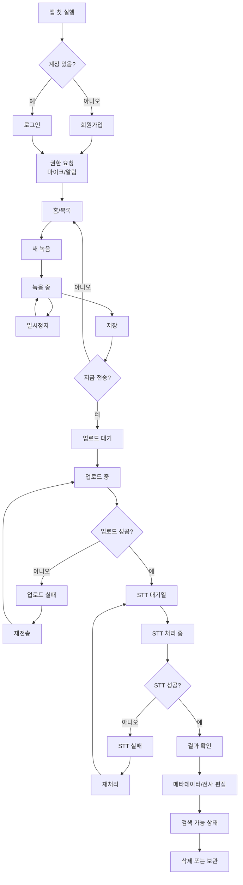
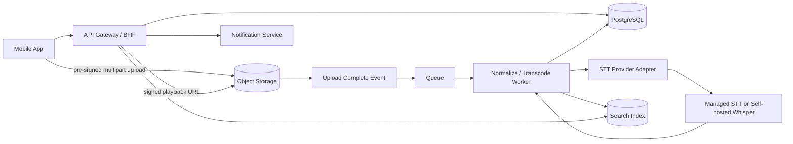

# 모바일 녹음·전송·STT 관리 앱 기획서

## Executive Summary

[assumption] 타깃 플랫폼은 미정이므로 iOS/Android 공통의 mobile-first 정보구조와 API를 제안한다. [assumption] 실시간 STT 요구는 미정이므로 기본 설계는 batch-first이며, real-time은 옵션 비교만 포함한다.

이 앱의 MVP는 “로컬에 안전하게 저장되는 녹음 클라이언트 + 객체 스토리지 직접 업로드 + 비동기 STT 큐 + 편집 가능한 결과 저장소 + 검색” 구조로 설계하는 것이 맞다. 이유는 주요 STT 서비스가 모두 batch/async 또는 별도 파일·지연 제약을 가지며, 실시간 스트리밍은 정확도 편차와 운영 복잡도가 더 크기 때문이다. 예를 들어 OpenAI의 직접 전사 API는 업로드 파일이 25MB로 제한되고, Azure batch transcription은 피크 시간에 시작까지 최대 30분, 완료까지 최대 24시간이 걸릴 수 있다. 독립 연구에서도 common ASR services는 vendor와 오디오 조건에 따라 정확도 편차가 크고, streaming 품질이 유의하게 낮게 나타났다. citeturn20view0turn22view0turn32view2

필수 범위는 로그인, 녹음 시작/일시정지/재개/저장, 전송 상태 확인, 업로드 실패 재전송, STT 실패 재처리, 결과 보기/편집, 목록/재생/삭제, 메타데이터 편집, 제목·태그·전사문 검색, 최소 보안·감사로그까지다. 실시간 부분자막, 협업 주석, 요약/액션아이템 생성은 후순위가 맞다. 실시간을 먼저 넣으면 UI와 서버가 사실상 두 개의 제품이 된다.

STT 벤더는 초기에 hard-code하면 안 된다. 공식 요금과 제약 차이가 크다. Google V2 standard는 $0.016/분이고 dynamic batch는 $0.003/분, AWS는 예시상 Tier 1 $0.024/분, Azure는 batch $0.225/시간·real-time $1.20/시간, OpenAI gpt-4o-transcribe는 분당 추정 $0.006, mini는 $0.003 수준이다. 한국어 정확도 역시 도메인에 따라 달라서, 2024년 한국어 아동 음성 비교 연구에서는 Azure가 가장 높고 Amazon이 가장 낮았지만 이를 일반 성인·업무 음성으로 바로 일반화할 수는 없다. 따라서 “provider adapter + 2주 benchmark”가 현실적으로 가장 안전한 선택이다. citeturn7view0turn8view3turn9search1turn29view4turn32view0

단일 선택이 꼭 필요하다면, 한국어 중심의 내부 업무용 메모/인터뷰 앱은 Azure Batch를 1순위, 다국어와 Google 생태계·dynamic batch 비용 효율을 중시하면 Google Chirp 3를 1순위로 보는 것이 합리적이다. 한국 리전과 한국어 중심 운영을 강하게 원하면 CLOVA Speech도 shortlist에 넣어야 한다. OpenAI는 prototyping과 diarization, Realtime 확장성은 좋지만 장문 파일은 25MB 제약을 우회하는 chunking 설계가 선행돼야 한다. citeturn25view0turn22view1turn11view1turn29view3turn20view4

## 제품 목표와 우선순위

이 제품의 핵심은 “녹음”이 아니라 “손실 없는 캡처 → 재시도 가능한 업로드 → 감사 가능한 전사 → 수정 가능한 기록 자산화”다. 따라서 요구사항 우선순위는 UI의 화려함보다 상태 관리와 데이터 일관성에 맞춰야 한다.

| 우선순위 | 범주 | 포함 기능 | 비고 |
| --- | --- | --- | --- |
| 필수 | 계정/인증 | 회원가입, 로그인, 로그아웃, 토큰 재발급, 비밀번호 재설정, 약관/개인정보 동의 | 이메일/비밀번호 기준 |
| 필수 | 녹음 | 시작, 일시정지, 재개, 중지, 임시저장, 자동저장, 앱 종료·통화 인터럽트 복구 | 녹음 유실 방지 |
| 필수 | 업로드 | 업로드 세션 생성, 백그라운드 업로드, 업로드 상태, 실패 재전송, 체크섬 검증 | “재전송” 필수 |
| 필수 | 처리 | STT 요청, STT 상태, 실패 재처리, 결과 수신, 처리이력 | 업로드 재시도와 분리 |
| 필수 | 관리 | 목록, 정렬, 필터, 재생, 삭제, 메타데이터 편집, 검색 | title/tag/full-text |
| 필수 | 전사 결과 | 원문 보기, 편집본 저장, 버전 분리, 기본 segment 표시 | 수정 이력 보존 |
| 필수 | 운영 | 감사로그, 에러 모니터링, 보관기간 정책, 개인정보처리방침 반영 | 출시 필수 |
| 우선 | 편의 기능 | social login, push 알림, folder/tag bulk action, export TXT/SRT, diarization, phrase hint/custom vocab | 운영 효율 개선 |
| 후순위 | 확장 기능 | real-time partial transcription, 협업 주석, 요약/액션아이템, 공유링크, on-device STT fallback | 별도 제품군 가능 |

실무적으로는 “재전송”과 “재처리”를 분리해야 한다. 재전송은 파일 업로드 실패를 다시 시도하는 것이고, 재처리는 이미 서버에 있는 원본 파일에 대해 STT를 다시 수행하는 것이다. 이 둘을 한 버튼으로 합치면 고객지원, 로그 분석, 비용 통제, 장애 원인 파악이 모두 어려워진다.

## 사용자 흐름과 화면 설계

사용자에게는 “녹음 저장 완료”, “업로드 완료”, “전사 완료”를 분리해서 보여줘야 한다. 업로드 완료가 곧 전사 완료는 아니다. 이 분리는 batch STT의 비동기 특성과, 서비스별 시작 지연·파일 크기 제약을 고려하면 필수다. citeturn22view0turn20view0turn25view0



화면은 많아 보이지만 실제로는 6개면 충분하다.

| 화면 | 목적 | 주요 UI 블록 | 주요 액션 | 반드시 있어야 할 상태 |
| --- | --- | --- | --- | --- |
| 로그인/회원가입 | 계정 진입 | 이메일, 비밀번호, 동의 체크박스, 비밀번호 재설정 | 가입, 로그인, 비밀번호 초기화 | 동의 미체크, 로그인 실패 |
| 권한 온보딩 | 마이크/알림 권한 확보 | 권한 설명, 허용 CTA, 나중에 하기 | 권한 허용, 설정 이동 | 마이크 거부 |
| 홈/목록 | 전체 녹음 관리 | 검색창, 필터칩, 정렬, 탭(All/Uploading/Done/Failed), FAB 녹음 | 검색, 재생, 상세 진입, 삭제 | 빈 목록, 업로드 실패 목록 |
| 녹음 | 핵심 캡처 | 타이머, waveform, 일시정지/재개, 중지, 임시저장, 제목 입력 | 시작, pause/resume, stop/save | 저장공간 부족, mic 충돌 |
| 상세/재생 | 원본 관리 | 오디오 플레이어, 상태 배지, 메타데이터, 재전송/재처리 버튼 | 재생, 메타데이터 수정, 삭제 | 업로드 실패, 처리 실패 |
| 전사 결과/편집 | 텍스트 자산화 | 원문/편집본 탭, segment 리스트, speaker/time label, 저장 버튼 | 편집, 버전 저장, 검색 대상 반영 | 결과 없음, 부분 결과 |
| 검색 결과 | 기록 회수 | query, 하이라이트, 필터, 최근 검색 | 상세 이동, 정렬 변경 | 검색 결과 없음 |

핵심 화면만 ASCII 와이어로 적으면 아래 수준이면 충분하다.

```text
[홈/목록]
┌──────────────────────────────┐
│ 검색...                      │
│ [All] [Uploading] [Done] ... │
├──────────────────────────────┤
│ 제목 / 상태배지 / 길이       │
│ 전사 미리보기 2줄            │
│ 2026-05-08 10:20   ⋮         │
├──────────────────────────────┤
│ 제목 / 상태배지 / 길이       │
│ 전사 미리보기 2줄            │
└──────────────────────────────┘
                    [+ 녹음]

[녹음]
┌──────────────────────────────┐
│ 제목(선택)                   │
│            00:03:12          │
│      ~ waveform ~            │
│ [일시정지] [중지/저장]        │
│ [백그라운드 저장]            │
└──────────────────────────────┘

[상세/전사]
┌──────────────────────────────┐
│ 제목              [편집]      │
│ [재생바] 03:12               │
│ 업로드 완료 / STT 완료        │
│ 태그, 언어, 생성일            │
├──────────────────────────────┤
│ [원문] [편집본]              │
│ 00:00-00:08 Speaker 1 ...    │
│ 00:08-00:14 Speaker 2 ...    │
│ ...                          │
├──────────────────────────────┤
│ [재처리] [삭제]               │
└──────────────────────────────┘
```

## 데이터 모델과 상태 설계

이 앱은 상태를 하나로 합치면 안 된다. `status = failed`만으로는 어떤 실패인지 알 수 없기 때문이다. 최소한 `recording_state`, `upload_state`, `transcription_state`를 나눠야 한다. 이것만 잘해도 운영 난이도가 크게 내려간다.

### 권장 엔터티

| 엔터티 | 핵심 필드 | 설명 |
| --- | --- | --- |
| User | `id`, `email`, `password_hash` 또는 `oidc_subject`, `display_name`, `locale`, `created_at`, `last_login_at` | 사용자 계정 |
| Recording | `id`, `user_id`, `title`, `note`, `tags[]`, `duration_ms`, `language_hint`, `client_codec`, `sample_rate_hz`, `channels`, `file_size_bytes`, `checksum_sha256`, `original_object_key`, `deleted_at`, `created_at` | 원본 녹음 메타데이터 |
| UploadJob | `id`, `recording_id`, `status`, `attempt_count`, `bytes_uploaded`, `bytes_total`, `started_at`, `finished_at`, `error_code`, `error_message` | 업로드 시도 이력 |
| TranscriptionJob | `id`, `recording_id`, `provider`, `provider_job_id`, `mode(batch/realtime)`, `status`, `language_detected`, `diarization_enabled`, `started_at`, `finished_at`, `error_code` | STT 처리 단위 |
| TranscriptSegment | `id`, `transcription_job_id`, `speaker_label`, `start_ms`, `end_ms`, `text`, `confidence_avg` | 편집/검색/재생 싱크용 segment |
| TranscriptVersion | `id`, `recording_id`, `source_transcription_job_id`, `version_no`, `edited_text`, `edited_by_user_id`, `created_at` | 사용자가 수정한 편집본 |
| AuditLog | `id`, `actor_user_id`, `action`, `target_type`, `target_id`, `ip`, `user_agent`, `metadata_json`, `created_at` | 감사 및 추적 |

### 권장 상태값

| 상태 종류 | 값 |
| --- | --- |
| `recording_state` | `draft`, `recording`, `paused`, `saved_local`, `archived`, `deleted` |
| `upload_state` | `not_started`, `queued`, `uploading`, `uploaded`, `failed`, `retrying` |
| `transcription_state` | `not_requested`, `queued`, `processing`, `completed`, `failed`, `cancelled` |

### 설계 포인트

`Recording`에는 원본 파일 자체보다 “원본 파일의 위치와 검증정보”를 저장하고, 실제 사용자 편집 결과는 `TranscriptVersion`에 분리 저장하는 것이 낫다. 그래야 원본 STT 결과와 사용자 수정 결과를 동시에 보존할 수 있다. 검색 인덱스는 보통 최신 `TranscriptVersion.edited_text`를 우선 사용하고, 없으면 최신 성공한 `TranscriptionJob`의 정규화 텍스트를 fallback으로 잡는다.

메타데이터 편집은 title, note, tags, language_hint, retention_label 정도면 충분하다. 처음부터 커스텀 필드 빌더를 넣을 필요는 없다. 대신 `metadata_json` 확장 필드를 남겨두면 이후 폼을 깨지 않고 확장할 수 있다.

## API와 업로드·STT 설계

업로드와 전사는 반드시 비동기 API로 설계해야 한다. 서비스별 제약이 다르기 때문이다. Google Chirp 3의 `Recognize`는 1분 이하에 적합하고 `BatchRecognize`는 일반적으로 1분~1시간 길이의 오디오를 다루며, OpenAI는 직접 업로드가 25MB 제한이고, CLOVA Speech 장문 인식은 batch async 기준 최대 6시간까지 지원한다. Azure 역시 batch transcription을 비동기 흐름으로 설명한다. citeturn25view0turn20view0turn11view1turn22view0

### API 목록

| Method | Path | 설명 | 비고 |
| --- | --- | --- | --- |
| POST | `/v1/auth/signup` | 회원가입 | 이메일 또는 OIDC 확장 가능 |
| POST | `/v1/auth/login` | 로그인 | JWT access + refresh |
| POST | `/v1/auth/refresh` | access token 재발급 | refresh rotation 권장 |
| GET | `/v1/me` | 내 정보 조회 | 프로필/정책 표시 |
| POST | `/v1/recordings` | 로컬 저장용 draft 생성 | 업로드 전 메타데이터 확보 |
| POST | `/v1/recordings/{id}/upload-sessions` | 업로드 세션 생성 | pre-signed/multipart 정보 반환 |
| POST | `/v1/upload-sessions/{id}/complete` | 업로드 완료 신고 | 서버가 checksum/size 검증 |
| POST | `/v1/recordings/{id}/transcriptions` | STT 요청 생성 | language/provider/mode 옵션 |
| POST | `/v1/transcriptions/{id}/retry` | STT 재처리 | same file, new job |
| GET | `/v1/recordings` | 목록 조회 | query/status/tag/sort/cursor |
| GET | `/v1/recordings/{id}` | 상세 조회 | 상태, 메타, transcript 포함 |
| PATCH | `/v1/recordings/{id}` | 메타데이터 수정 | title/note/tags/language_hint |
| POST | `/v1/recordings/{id}/transcript-versions` | 편집본 저장 | version increment |
| GET | `/v1/search` | 통합 검색 | title/tag/transcript |
| DELETE | `/v1/recordings/{id}` | soft delete | 즉시 hard delete 금지 |

### 요청/응답 예시

녹음 draft 생성:

```json
POST /v1/recordings
{
  "title": "고객 인터뷰 1차",
  "language_hint": "ko-KR",
  "client_codec": "m4a_aac_lc",
  "sample_rate_hz": 16000,
  "channels": 1,
  "duration_ms": 0
}
```

```json
201 Created
{
  "recording_id": "rec_01JT...",
  "recording_state": "draft",
  "upload_state": "not_started",
  "transcription_state": "not_requested"
}
```

업로드 세션 생성:

```json
POST /v1/recordings/rec_01JT.../upload-sessions
{
  "file_name": "rec_20260508_101233.m4a",
  "file_size_bytes": 4839201,
  "checksum_sha256": "b2c4..."
}
```

```json
201 Created
{
  "upload_session_id": "upl_01JT...",
  "storage_strategy": "multipart_presigned",
  "part_size_bytes": 5242880,
  "expires_at": "2026-05-08T11:15:00Z",
  "parts": [
    {
      "part_number": 1,
      "url": "https://..."
    }
  ]
}
```

STT 요청 생성:

```json
POST /v1/recordings/rec_01JT.../transcriptions
{
  "provider": "azure",
  "mode": "batch",
  "language_hint": "ko-KR",
  "diarization_enabled": true,
  "custom_vocabulary_id": null
}
```

```json
202 Accepted
{
  "transcription_job_id": "trn_01JT...",
  "status": "queued",
  "provider": "azure",
  "estimated_completion": null
}
```

상세 조회:

```json
GET /v1/recordings/rec_01JT...
```

```json
200 OK
{
  "recording": {
    "id": "rec_01JT...",
    "title": "고객 인터뷰 1차",
    "duration_ms": 192300,
    "upload_state": "uploaded",
    "transcription_state": "completed",
    "language_detected": "ko-KR",
    "created_at": "2026-05-08T10:12:33Z"
  },
  "audio": {
    "playback_url": "https://signed-url...",
    "codec": "m4a_aac_lc"
  },
  "transcript": {
    "version_no": 2,
    "edited_text": "안녕하세요. 오늘 인터뷰는...",
    "segments": [
      {
        "start_ms": 0,
        "end_ms": 5400,
        "speaker_label": "S1",
        "text": "안녕하세요."
      }
    ]
  }
}
```

### 파일 포맷·압축·전송 방식

권장 기본값은 “클라이언트는 압축 포맷으로 녹음하고, 서버는 STT용 파생본을 lossless 또는 provider-friendly 포맷으로 정규화”하는 방식이다. 이유는 모바일 네트워크 비용과 저장공간, 그리고 STT 정확도 요구가 서로 다르기 때문이다. 16kHz는 음성에 일반적으로 충분하고, Google과 AWS는 원본을 제어할 수 있다면 FLAC 또는 PCM 16-bit 같은 lossless 포맷을 권장한다. Google은 OGG_OPUS/WEBM_OPUS를 지원하지만 lossy 포맷은 인식 정확도에 영향을 줄 수 있다고 설명하고, AWS도 best results를 위해 FLAC 또는 WAV PCM 16-bit를 권장한다. OpenAI는 `mp3/mp4/m4a/wav/webm` 등을 지원하지만 직접 업로드는 25MB 제한이 있다. citeturn22view2turn26view0turn27view0turn20view0

| 항목 | 권장 기본값 | 이유 |
| --- | --- | --- |
| 모바일 녹음 포맷 | `m4a(AAC-LC)` 또는 `Ogg/WebM Opus` | 업로드 용량 절감, OS 기본 지원 활용 |
| 샘플레이트 | `16kHz`, mono | 음성용으로 충분, 파일 크기 절감 |
| 서버 정규화 포맷 | `FLAC` 또는 `PCM 16-bit mono 16kHz` | STT 정확도 우선 시 유리 |
| 보관 전략 | 원본 압축본 + STT용 파생본 | 재생 최적화와 재처리 분리 |
| 전송 방식 | pre-signed URL + multipart/resumable | 앱 종료/재개/불안정 네트워크 대응 |
| 무결성 검증 | SHA-256 + size 검증 | 중복 업로드와 전송 손상 방지 |
| 재시도 정책 | `1s → 3s → 10s → 30s → 120s`, 최대 5회 | 과도한 폭주 방지 |
| 멱등성 키 | `recording_id + checksum_sha256` | 중복 생성/중복 과금 방지 |

단순 환산 기준으로 24kbps 오디오는 시간당 약 10.5MB, 32kbps는 약 14.1MB이며, 16kHz mono PCM 16-bit는 시간당 약 112.5MB다. 따라서 “장기 보관은 압축 원본, STT 직전 정규화는 서버”가 비용과 정확도의 균형이 가장 좋다. citeturn39calculator0turn39calculator1turn39calculator2

추가로, Google Chirp 3는 word-level timestamps를 지원하지만 성능 저하가 예상된다고 문서에 적고 있다. 따라서 MVP에서는 segment-level timestamp를 기본값으로 두고, per-word highlight는 후순위가 맞다. citeturn25view0

### STT 파이프라인 요구사항

STT 파이프라인은 최소한 다음 요구를 만족해야 한다.

1. 언어 힌트와 자동 감지를 둘 다 지원할 것  
2. batch와 realtime을 분리한 job 모델을 가질 것  
3. provider raw JSON을 보존할 것  
4. 사용자 편집본은 provider 결과와 분리 저장할 것  
5. domain vocabulary hint를 주입할 수 있을 것  
6. segment timestamp와 speaker label을 후처리 가능한 구조로 저장할 것  
7. 재처리 시 provider를 바꿔도 데이터 모델이 깨지지 않을 것

도메인 특화 용어는 실제 오류의 큰 원인이다. 한국 기상 도메인 ASR 연구에서도 specialized terminology가 주요 오류 원인으로 남았고, Google은 speech adaptation, Azure는 phrase list/custom speech, AWS는 custom vocabulary와 custom language model, OpenAI는 프롬프트와 별도 후처리 파이프라인으로 이를 보완하는 식이다. 따라서 초기 설계에서 vocabulary/phrase hint 주입 포인트를 반드시 남겨야 한다. citeturn32view1turn25view0turn22view1turn24view0

### STT 서비스 비교

| 서비스 | 처리 방식 | 한국어/기능 포인트 | 데이터 처리 메모 | 비용 기준 |
| --- | --- | --- | --- | --- |
| urlGoogle Cloud Speech-to-Textturn5view0 | 동기, 스트리밍, batch | Chirp 3에서 `ko-KR` GA, automatic language detection, diarization, speech adaptation 지원 | V2는 data residency, audit logging, CMEK 지원. 기본적으로 customer audio/transcript logging off, opt-in 시 data logging 가능 | standard $0.016/분, dynamic batch $0.003/분 |
| urlAmazon Transcribeturn5view1 | batch, streaming | `ko-KR`는 batch·streaming 지원. global feature matrix상 diarization/channel identification/custom vocabulary 가능. 다만 한국어는 custom language model·redaction 미지원 | AWS 문서는 품질 개선을 위해 content를 일시 저장할 수 있다고 명시 | 예시상 Tier 1 $0.024/분, 15초 최소 과금 |
| urlAzure Speech to Textturn22view1 | real-time, fast, batch, custom speech | `ko-KR` locale 지원, phrase list/custom speech, diarization 최대 35 speakers | real-time은 서버 메모리에서 처리하고 at-rest 저장 없음. batch는 고객 저장소 또는 TTL 설정 가능 저장소 사용 | batch $0.225/시간, real-time $1.20/시간 |
| urlOpenAI Speech-to-Text APIturn5view3 | file transcription, stream events, realtime | 한국어 지원, `gpt-4o-transcribe-diarize` 제공, Realtime API 지원 | API 데이터는 opt-in 하지 않으면 학습에 사용하지 않음 | gpt-4o-transcribe 약 $0.006/분, mini 약 $0.003/분 |
| urlWhisperturn28view0 | self-hosted batch/realtime pipeline 구성 가능 | 680,000시간 multilingual data 기반, timestamps/translation 가능 | 관리형 SLA 없음. GPU·배포·운영은 전부 직접 부담 | 라이선스 비용은 없지만 infra 비용 가변 |
| urlCLOVA Speechturn11view2 | batch, streaming | 장문 인식 최대 6시간(batch, async), streaming은 한국어/영어/일본어 지원, 한국 리전 중심 | 15초 단위 과금, batch/streaming 모두 한국어 문서가 잘 정리됨 | 공식 예시 기준 장문 인식 10초=5원, 32초=15원 [uncertain] |

표의 배치/실시간, 지원 언어, 요금, 데이터 처리 특성은 각 공식 문서와 한국어 논문 기준이다. Google Chirp 3는 배치·스트리밍·동기와 diarization/adaptation을, AWS는 기능 매트릭스와 한국어 feature 지원범위를, Azure는 batch/real-time/custom speech와 privacy 흐름을, OpenAI는 file limit·Realtime·diarization·data control을, CLOVA는 한국 리전·6시간 batch async·15초 단위 과금 예시를 명시한다. citeturn25view0turn7view0turn35view0turn24view0turn23view1turn8view4turn22view1turn22view0turn9search1turn35view1turn20view0turn20view4turn29view3turn29view4turn35view2turn28view0turn11view1turn12view0turn12view3

실무 판단은 다음처럼 정리하면 된다.  
한국어 중심이고 custom speech까지 염두에 두면 Azure가 가장 안정적이다. 다국어와 batch 비용 효율을 중시하면 Google이 좋다. AWS-native 아키텍처라면 Amazon Transcribe는 무난하지만, 한국어 custom language model 부재는 약점이다. OpenAI는 가격과 개발 속도는 좋지만 25MB direct limit 때문에 장문 녹음 앱의 sole provider로 두기에는 초기 chunking 설계가 필요하다. Whisper self-hosting은 개인정보·망분리·온프레미스 요구가 있을 때만 의미가 크다.

## 인프라·보안·개인정보

권장 인프라는 “API/BFF + PostgreSQL + Object Storage + Queue + Worker + Search”의 단순한 구조로 시작하는 것이다. Azure batch는 고객 저장소를 지정하는 구조를 사용하고, AWS batch도 S3 기반이며, Google V2는 audit logging/CMEK/data residency를 제공한다. 따라서 앱 서버를 파일 중계기로 쓰기보다, 메타데이터와 권한만 관리하고 오디오는 객체 스토리지로 직접 올리는 구조가 맞다. citeturn35view1turn27view0turn34search0



### 서버 인프라·스케일링 권장안

초기에는 modular monolith로 시작해도 충분하다. 인증, recording API, search API, worker를 하나의 codebase로 두고 배포만 분리하는 방식이 가장 빠르다. 월 수천~수만 건 수준에서는 PostgreSQL full-text search로도 버틸 수 있다. 이후 녹음 건수가 커지고 transcript segment가 수백만 row를 넘기면 그때 OpenSearch 계열로 옮기면 된다.

확장 포인트는 네 군데다.  
첫째, upload session 발급과 metadata API는 stateless로 유지한다.  
둘째, transcode와 STT worker는 큐 소비량에 따라 수평 확장한다.  
셋째, provider adapter를 서비스 경계로 분리해서 multi-vendor fallback을 쉽게 만든다.  
넷째, search index는 비동기 갱신으로 운영해 전사 완료와 검색 반영을 분리한다.

### 보안 기본 원칙

| 영역 | 권장안 |
| --- | --- |
| 인증 | OIDC 또는 자체 계정 + JWT access/refresh, refresh rotation |
| 권한 | recording owner 기준 row-level authorization |
| 업로드 | pre-signed URL, 만료 5~15분, content-length/type 제한 |
| 저장 | object storage SSE-KMS, DB at-rest encryption, TLS 1.2+ |
| 무결성 | SHA-256, MIME sniffing, duration/bitrate sanity check |
| 재생 | signed playback URL, 짧은 만료, 다운로드 권한 분리 |
| 비밀관리 | Secret Manager/KMS 사용, 앱 번들에 비밀키 금지 |
| 감사 | request_id, upload_job_id, transcription_job_id, actor_id 전부 로그화 |
| 백업 | DB PITR 7~35일, object storage versioning 선택 적용 |

### 개인정보·법적 체크리스트

오디오와 전사문은 맥락에 따라 개인정보 또는 민감한 정보가 될 수 있다. Azure 문서도 음성과 관련 전사문이 personal data 또는 sensitive data로 볼 수 있다고 명시한다. 또한 한국 개인정보보호법상 개인정보는 성명·영상 등으로 개인을 알아볼 수 있는 정보뿐 아니라 다른 정보와 쉽게 결합해 특정인을 알아볼 수 있는 정보까지 포함한다. citeturn35view1turn18search14

| 체크 항목 | 법적·정책 요구 | 제품 반영 |
| --- | --- | --- |
| 녹음 고지 | 통신비밀보호법은 공개되지 아니한 타인간의 대화 비밀녹음을 금지한다. 판례상 대화 당사자 녹음은 해당 조항 위반으로 보지 않지만, 제3자 비밀녹음은 금지된다. citeturn16search2turn40search0turn40search5 | 녹음 시작 전 “상대방 고지 및 필요한 동의를 받았는지” 확인 체크를 두고, 기업용이면 통화 시작 안내 멘트를 옵션 제공 |
| 개인정보 수집·이용 동의 | 각각의 동의 사항을 구분해 명확히 알리고 동의를 받아야 하며, 거부권과 불이익을 알려야 한다. 기본 체크박스 pre-check는 금지다. citeturn16search11turn14view4turn14view3 | 약관, 개인정보 수집·이용, 국외이전/제3자 제공을 분리 체크 |
| 개인정보처리방침 | 처리 목적, 보유기간, 제3자 제공, 파기절차·방법, 처리 항목, 국외이전 근거와 내용, 안전성 확보조치 등을 공개해야 한다. citeturn17search8turn17search11 | 앱/웹에 상시 링크, 가입 화면과 설정 화면 양쪽에 노출 |
| 국외이전 | 국외이전 근거와 동의내용을 처리방침에 공개해야 하고 보호조치를 해야 한다. citeturn19search2turn19search4 | 해외 STT 사용 시 국가, 수탁자, 이전 항목, 목적, 보관기간, 문의처 명시 |
| 접속기록 | 접속기록은 최소 1년 보관해야 하고, 일정 규모 이상 또는 고유식별정보·민감정보 처리 시 2년 이상 보관해야 한다. citeturn33search1turn33search2 | 기본 1년, 법적 요건 충족 시 2년으로 확장 가능하게 설계 |
| 안전조치 | 개인정보 보호법 제29조는 접속기록 보관 등 안전성 확보조치를 요구한다. citeturn16search4 | 접근권한 분리, 로그 보관, 암호화, 관리자 액션 감사 |

벤더 기본값도 체크해야 한다. Google Cloud Speech-to-Text는 기본적으로 customer audio/transcript logging을 하지 않으며 opt-in 시 data logging이 가능하다. Azure real-time은 at-rest 저장이 없고 batch는 고객 저장소 또는 TTL 기반 저장이 가능하다. AWS는 품질 개선을 위해 content를 일시 저장할 수 있다고 안내한다. OpenAI API는 opt-in 하지 않으면 API 데이터를 학습에 사용하지 않는다. 이 차이는 개인정보처리방침, 위탁계약서, 사내 보안심의 항목에 직접 반영해야 한다. citeturn35view0turn35view1turn27view0turn35view2

[assumption] 기본 보관정책은 원본 오디오 90일, raw provider JSON 30일, 편집본 transcript는 사용자가 삭제하기 전까지 유지, soft delete 이후 30일 뒤 hard delete 정도가 적절하다. 다만 B2B 고객이라면 workspace별 retention override가 반드시 필요하다.

## 테스트·일정·비용 추정

### 에러·모니터링·로깅 전략

이 앱의 장애는 대부분 네 구간에서 난다. 마이크 권한/녹음, 업로드, STT provider, 검색 인덱싱이다. 따라서 로그 구조도 이 네 구간 중심이어야 한다. 최소 필드는 `request_id`, `user_id`, `recording_id`, `upload_job_id`, `transcription_job_id`, `provider`, `error_code`, `error_message`, `latency_ms`, `app_version`, `network_type`다.

운영 지표는 아래 정도면 충분하다.

- 녹음 저장 성공률
- 업로드 성공률 / 재시도율 / checksum mismatch 비율
- STT 처리 성공률
- STT turnaround time p50/p95
- transcript edit rate
- search hit rate
- provider별 장애율과 비용

에러코드는 제품 UX와 운영을 같이 보이게 설계하는 것이 좋다. 예를 들면 `mic_permission_denied`, `upload_url_expired`, `upload_checksum_mismatch`, `provider_quota_exceeded`, `unsupported_language`, `transcript_merge_failed` 정도로 나누면 고객지원이 빨라진다.

### 테스트 전략

추천 테스트 구성은 다음과 같다.

| 테스트 레이어 | 범위 | 합격 기준 |
| --- | --- | --- |
| Unit | 상태 전이, checksum, transcript merge, metadata validation | 상태 전이 오류 0 |
| Integration | object storage, queue, DB, provider adapter | 멱등성 보장 |
| Contract | 각 STT provider request/response schema | provider API 변경 감지 |
| E2E | 회원가입→녹음→업로드→전사→편집→검색 | 핵심 시나리오 100% 통과 |
| Resilience | 네트워크 끊김, 앱 종료, signed URL 만료, provider timeout | 재시도 후 복구 |
| Golden-set Benchmark | 조용한 음성, 소음, 전화품질, 다화자, 영어 혼합, 도메인 용어 | WER/CER, segment drift, TAT 비교 |

[assumption] Golden set은 최소 50개, 가능하면 200개 파일로 만든다. 조용한 회의실 음성만 넣으면 벤더 선정이 왜곡된다. 반드시 휴대폰 마이크, 이어폰 마이크, 자동차/카페 소음, 장문 침묵, 영어 고유명사 혼입 케이스를 포함해야 한다.

### 개발 일정과 인력

[assumption] cross-platform 모바일 1개 코드베이스를 전제로 하면 14~18주 MVP가 현실적이다. iOS/Android를 각각 native로 분리하면 4~6주 추가를 잡는 편이 안전하다.

| 단계 | 기간 | 주요 산출물 | 핵심 인력 |
| --- | --- | --- | --- |
| 요구정의·보안/법무 체크 | 2주 | PRD, 화면흐름, 동의/처리방침 초안, benchmark plan | PM/PO, Designer, Backend |
| 인증·녹음·로컬 저장 | 3주 | auth, 녹음 엔진, local draft, 기본 목록 | Mobile, Backend |
| 업로드·상태관리 | 3주 | upload session, multipart/resume, 상태배지, 재전송 | Mobile, Backend |
| STT 연동·결과 편집 | 4주 | provider adapter, transcript model, 편집 UI, search | Backend, Mobile |
| 운영·보안·테스트 | 2~3주 | 로그/알림, retention, QA suite, benchmark report | Backend, QA, DevOps |
| 베타·수정·출시 | 2~3주 | 결함 수정, 성능 안정화, 배포 문서 | 전원 |

권장 코어팀은 PM/PO 0.5~1, Designer 0.3~0.5, Mobile 1~2, Backend 1~2, QA 0.5~1, DevOps 0.2~0.5 FTE다. 실시간 STT까지 같이 넣으면 mobile과 backend 모두 인력이 더 필요하다.

### STT 비용 추정

아래 표는 벤더 공식 단가를 기준으로 한 순수 STT 비용 비교다. 저장소, 네트워크, 알림, 요약 LLM, 운영 인건비는 제외다.

| 서비스 | 100시간/월 | 1,000시간/월 | 비고 |
| --- | --- | --- | --- |
| urlGoogle Cloud Speech-to-Text Standardturn5view0 | $96 | $960 | $0.016/분 |
| urlGoogle Cloud Speech-to-Text Dynamic Batchturn5view0 | $18 | $180 | $0.003/분 |
| urlAmazon Transcribeturn5view1 | $144 | $1,440 | 예시상 Tier 1 $0.024/분 |
| urlAzure Speech Batchturn22view1 | $22.5 | $225 | $0.225/시간 |
| urlAzure Speech Real-timeturn22view1 | $120 | $1,200 | $1.20/시간 |
| urlOpenAI gpt-4o-transcribeturn5view3 | $36 | $360 | 공식 추정 $0.006/분 |
| urlOpenAI gpt-4o-mini-transcribeturn5view3 | $18 | $180 | 공식 추정 $0.003/분 |

표의 금액은 공식 단가를 시간 단위로 환산한 값이다. Google과 AWS는 분당 과금, Azure는 시간당 과금, OpenAI는 공식 estimated cost per minute를 제공한다. Azure pricing은 region과 tier에 따라 달라질 수 있고, AWS는 tiered pricing이다. citeturn7view0turn8view3turn8view4turn9search1turn29view4turn37calculator0turn37calculator1turn37calculator2turn37calculator3turn37calculator4turn37calculator5turn37calculator6turn38calculator0turn38calculator1turn38calculator2turn38calculator3turn38calculator4turn38calculator5turn38calculator6

CLOVA Speech는 fetched page에서 정가 표기가 비어 있었지만, 공식 예시상 장문 인식에서 10초 사용 시 5원, 32초 사용 시 15원이 과금된다. 이를 단순 환산하면 약 1,200원/시간 수준이지만, 실제 플랜·옵션·VAT에 따라 달라질 수 있어 발주 전 콘솔 확인이 필요하다. citeturn12view0turn41calculator0

### 구축비와 월 운영비

[assumption] 한국 시장 기준의 대략적인 예산 범위는 아래 수준이 실무적이다.

| 항목 | 추정 범위 | 비고 |
| --- | --- | --- |
| MVP 구축비 | 1.6억 ~ 3.4억원 | 14~18주, 4.5~6 FTE 기준 |
| 법무·개인정보 검토 | 500만 ~ 2,000만원 | 약관/처리방침/국외이전/위탁 검토 |
| 월 고정 인프라 | 50만 ~ 300만원 | API, DB, object storage, queue, monitoring |
| 월 QA/모니터링 SaaS | 20만 ~ 150만원 | crash, log, alerting 포함 |
| 월 변동 STT 비용 | 위 STT 표 참조 | 사용량·provider에 따라 크게 변동 |

결론적으로, 이 제품의 비용 구조에서 가장 큰 리스크는 “기술 난이도”보다 “vendor lock-in과 privacy 설계 미흡”이다. MVP는 batch-first로 작게 시작하고, provider adapter를 먼저 만든 뒤, 실제 샘플셋 benchmark로 1차 벤더를 고르는 것이 가장 싸고 빠르다. 그렇게 하면 이후 실시간 STT, 요약, 협업 기능을 붙여도 아키텍처를 다시 갈아엎지 않아도 된다.